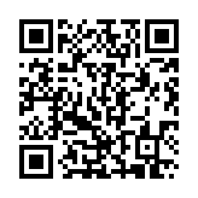

# qr

A QR Code generator for Go with **zero external dependencies** — standard
library only. It implements the encoding pipeline of **ISO/IEC 18004** (the
normative QR Code standard; there is no QR RFC) and produces symbols that
decode cleanly on independent scanners.

```
import "github.com/netstar-labs/qr"
```



Scan the code on the right — it points back to this repo, and it was generated
by this library (`cmd/qrgen`, level H) and read back by its own decoder, which
is how we know it scans.

## Scope

| Area | Support |
|------|---------|
| Modes | numeric, alphanumeric, byte (raw/UTF-8) |
| Versions | 1–40 (all), automatic smallest-fit selection |
| Error correction | L, M, Q, H |
| Masking | all 8 patterns, automatic lowest-penalty selection |
| Structure | finder/alignment/timing patterns, format & version info, block interleaving, Reed-Solomon over GF(256) |
| Output | `image/png`, ASCII, raw module matrix |
| Decoding | matrix decoder with Reed-Solomon **error correction**; clean-image PNG/JPEG/GIF reader |

Kanji mode and ECI are intentionally omitted. Byte mode emits the string's raw
bytes, which every modern decoder interprets as UTF-8.

## Usage

```go
code, err := qr.Encode("HELLO WORLD", qr.Quartile)
if err != nil {
    log.Fatal(err)
}

// PNG: 8 px per module, 4-module quiet zone (the standard minimum).
if err := code.WritePNGFile("out.png", 8, 4); err != nil {
    log.Fatal(err)
}

// Or inspect modules directly.
fmt.Println(code.Version, code.Size)
dark := code.Module(3, 3) // (x, y), zero-based from top-left
_ = dark
matrix := code.Matrix()   // [][]bool, true = dark
_ = matrix

// Or print to a terminal.
fmt.Print(code.String())
```

Force a version instead of auto-selecting:

```go
code, err := qr.EncodeVersion("PAYLOAD", qr.High, 10)
```

## Decoding

The package also decodes symbols, with full Reed-Solomon error correction:

```go
code, _ := qr.Encode("HELLO WORLD", qr.Quartile)

dec, err := code.Decode()          // from a QRCode
// or qr.DecodeMatrix(modules)     // from a [][]bool
// or qr.DecodePNG(reader)         // from a clean image
fmt.Println(dec.Text, dec.Version, dec.Level, dec.Mask, dec.Errors)
```

`DecodePNG` targets clean, high-contrast, **axis-aligned** images — the kind
this package renders, plus flat screenshots and scans. It is deliberately *not*
a perspective-correcting camera-photo decoder: it assumes an upright, unrotated
symbol with square modules on a light quiet zone. `dec.Errors` reports how many
codeword errors the Reed-Solomon stage corrected.

## API

Encoding:

- `Encode(content string, level Level) (*QRCode, error)`
- `EncodeVersion(content string, level Level, version int) (*QRCode, error)`
- `(*QRCode) Module(x, y int) bool`
- `(*QRCode) Matrix() [][]bool`
- `(*QRCode) String() string`
- `(*QRCode) PNG(w io.Writer, moduleSize, border int) error`
- `(*QRCode) WritePNGFile(path string, moduleSize, border int) error`

Decoding:

- `(*QRCode) Decode() (*Decoded, error)`
- `DecodeMatrix(modules [][]bool) (*Decoded, error)`
- `DecodePNG(r io.Reader) (*Decoded, error)`
- `Decoded{ Version, Level, Mask, Mode, Text, Errors }`

Levels: `Low`, `Medium`, `Quartile`, `High`

## CLI

```
go run ./cmd/qrgen -text "HELLO WORLD" -level Q -out code.png -scale 8 -border 4
go run ./cmd/qrgen -text "HELLO WORLD" -ascii
```

## Correctness

`go test ./...` validates:

- **Parameter tables** — every one of the 160 (version × level) error-correction
  block specifications is checked against the fixed total-codeword count for its
  version, so a transcription slip cannot pass silently.
- **Reed-Solomon** — generated codewords are verified to be divisible by the
  generator polynomial (all syndromes vanish), which proves the GF(256)
  arithmetic and encoder independently of any external vector.
- **BCH format/version info** — checked against known anchors (format M/mask0 =
  `0x5412`, version 7 = `0x07C94`) and validated as proper BCH codewords for
  every level/mask and every version 7–40.
- **Segment encoding** — numeric and alphanumeric bit streams matched against
  documented reference vectors.
- **Independent capacity cross-check** — a separately transcribed data-codeword
  capacity table (`capacity.go`) is asserted against the block structures in
  `ecTable`. Combined with the total-codeword check, this pins both the total
  and the data/EC split for every version and level, so even a swap between two
  entries with equal totals cannot pass silently.
- **Golden corpus** (`golden.txt`) — SHA-256 digests of the full module matrix
  for a representative set of version/level/mode cases. Each baseline was
  confirmed correct by decoding the rendered image with an independent scanner
  (zbar); the test then locks encoder output against drift.
- **Full round-trip** — every version × level is encoded near capacity and
  decoded with the native decoder; the recovered text, version and level must
  match.
- **Error correction** — the maximum correctable number of errors is injected
  (both at the module layer and directly at the Reed-Solomon layer) and the
  payload must be recovered; one error beyond capacity must not be silently
  "corrected".
- **End-to-end** — symbols are generated across all versions and levels; timing
  patterns and fixed structures are asserted.

The golden baselines were confirmed with an independent scanner (zbar) across
all modes and versions 1–40; that scanner is a test aid only and is **not** a
dependency of this library.

### Table cross-check

The hand-transcribed parameter tables were additionally diffed, entry by entry,
against two independent reference implementations of ISO/IEC 18004 — Project
Nayuki (`QR-Code-generator`) and Google ZXing — across all 160 (version × level)
error-correction entries and all 40 alignment-center rows, with zero
mismatches. See [verify/VERIFICATION.md](verify/VERIFICATION.md) for the record
and provenance. The audit is reproducible with the Python standard library only:

```
python3 verify/crosscheck.py
```

`verify/crosscheck.py` is a developer audit tool; it is not imported by the
library and does not affect the zero-dependency guarantee.

## Design notes

- No `unsafe`, no reflection, no third-party imports. The only standard-library
  packages used are `image`, `image/png`, `bufio`, `errors`, `io`, `os`, and
  `strings`.
- GF(256) uses primitive polynomial `0x11D` with primitive element `2`.
- The generator, format, and version polynomials are computed at runtime rather
  than hard-coded, minimizing transcription surface.

## License

Licensed under the Apache License, Version 2.0 — see [LICENSE](LICENSE).
